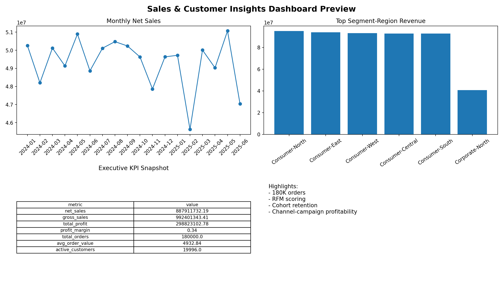

# Sales & Customer Insights Dashboard (High-End)

Enterprise-style analytics project for sales and customer intelligence.
Timeline: **Jan 2025 - Jun 2025**.

## What Makes This High-End
- Multi-dimensional dataset with **180K orders**, 20K customers, and 450 products.
- Rich business attributes: region, campaign, channel, payment method, order status, margin.
- Advanced analytics layers: **RFM scoring**, **cohort retention**, channel-campaign profitability, CLV proxy.
- SQL pack includes complex CTEs, cohort logic, and window-function trend analysis.
- Dashboard marts exported for Power BI/Excel consumption.

## Project Structure
- `scripts/generate_data.py`: realistic, large-scale synthetic data generation
- `src/pipeline.py`: data quality cleanup, dimensional joins, KPI marts, RFM and cohort outputs
- `src/eda.py`: trend and channel visuals for executive reporting
- `sql/analysis_queries.sql`: production-style business analytics SQL
- `dashboards/`: curated CSV marts for BI tools
- `reports/`: summary metrics and charts

## Run
```bash
python scripts/generate_data.py
python src/pipeline.py
python src/eda.py
```

## Key Outputs
- `/Users/abhishekkumar/Documents/Projects/sales-customer-insights-dashboard/dashboards/kpi_summary.csv`
- `/Users/abhishekkumar/Documents/Projects/sales-customer-insights-dashboard/dashboards/customer_rfm_scores.csv`
- `/Users/abhishekkumar/Documents/Projects/sales-customer-insights-dashboard/dashboards/cohort_retention.csv`
- `/Users/abhishekkumar/Documents/Projects/sales-customer-insights-dashboard/dashboards/channel_campaign_performance.csv`
- `/Users/abhishekkumar/Documents/Projects/sales-customer-insights-dashboard/reports/monthly_sales_trend.png`

## Portfolio Preview


## Recruiter Case Study
- `/Users/abhishekkumar/Documents/Projects/sales-customer-insights-dashboard/docs/CASE_STUDY.md`
